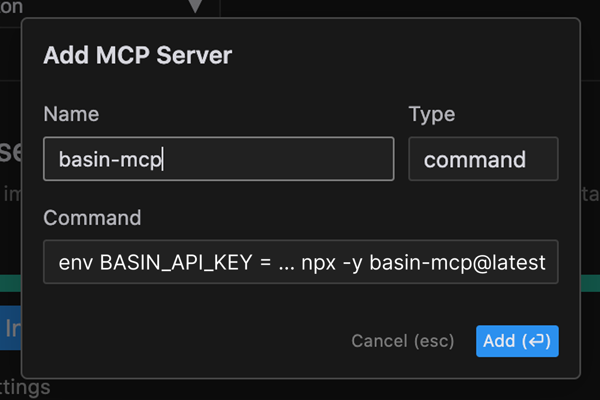

# Basin MCP Server

A Model Context Protocol (MCP) server for Basin AI integration that provides code quality and reliability testing.

## Installation

### One-line installation

If your code editor supports entering custom MCP server configuration in a single field, enter the following command:

```bash
npx -y basin-mcp@latest
```



Make sure to add `API_KEY` to the environment settings of the MCP server to pass the API key to the MCP server.

### Playwright
Basin relies on Playwright to run tests, so you may need to ensure it's installed on your computer before using Basin MCP for the first time. To install it, run the following command:

```bash
npm i -g playwright@latest
```

### Manual installation from `mcp_config.json` file

Add the following to your `mcp_config.json`:

```json
  "mcpServers": {
    "basin-mcp": {
      "command": "npx",
      "args": ["-y", "basin-mcp@latest"],
      "env": {
        "API_KEY": "your_api_key_here"
      }
    }
  }
```

## Usage

This package provides a Model Context Protocol (MCP) tool for code quality testing. The main tool is:

### check-generated-code

This tool must be invoked after every code generation step to ensure code quality and reliability by testing for bugs, hallucinations, and unintended changes. Once you are fully configured, use your AI code editor's chat interface to invoke this tool. You can make sure your code editor calls Basin MCP to check its work after every code generation step, by explicitly mentioning the Basin MCP tool and the URL where your web service is running in the chat prompt.

For example, you can say something like:

```
Generate ..., and test with Basin MCP tool, server is running at http://localhost:3000
```


## Parameters

The tool accepts following parameters:
- `prompt`: Original user prompt
- `serverUrl`: URL of the running local server
- `endpoints`: URLs of the new and changed endpoints
- `threadId`: Thread ID for conversation tracking
- `credentials`: (Optional) Authentication credentials if required
- `features`: List of features added/changed/removed per endpoint
- `elements`: List of UI elements and their IDs per endpoint

## Best Practices

Help Basin execute tests more reliably and more accurately by following these guidelines:

1. Keep Code Changes Small
   - Basin tests are quite comprehensive, and so the tests can slow down exponentially as the changes it tests become increasingly complex. Keep each changes small and isolated to avoid performance issues. If you can, limit your changes to one or two endpoints at a time.

2. Isolate Changes
   - Avoid bundling unrelated changes together. Isolating updates helps Basin test more accurately and makes debugging easier when issues arise. This also helps your copilot interpret Basin's test results to respond with more accurate and appropriate fixes to your code.

3. Declare Auth Requirements Explicitly
   - If your changes require authentication:
     - Clearly note it in your chat prompt, ideally with an endpoint for signing in or signing up.
     - Provide either:
       - Credentials (username and password) for an existing test account, or
       - Instructions for creating a new user that meets your test conditions.

## Terms and Conditions

The Basin AI tools are provided "as is", without any guarantees of any kind, express or implied. You are responsible for your use of the tools, and you assume all risks associated with such use, including but not limited to any loss of data, or any other loss.

By using the tools, you agree that Basin is not responsible for any damage or loss that may result from such use. You also agree that Basin assumes no responsibility for any privacy or security issues that may arise from such use.

You are responsible for ensuring that any data you upload or process using the tools is legal and compliant with all applicable laws and regulations. Basin makes no representations or warranties about the accuracy or completeness of any data or information processed using the tools.

You may only use the tools for lawful purposes. You may not use the tools to engage in any conduct that is illegal, harmful, or offensive, or that infringes the rights of any third party.

By using the tools, you agree to these Terms and Conditions. If you do not agree to these Terms and Conditions, you may not use the tools.
